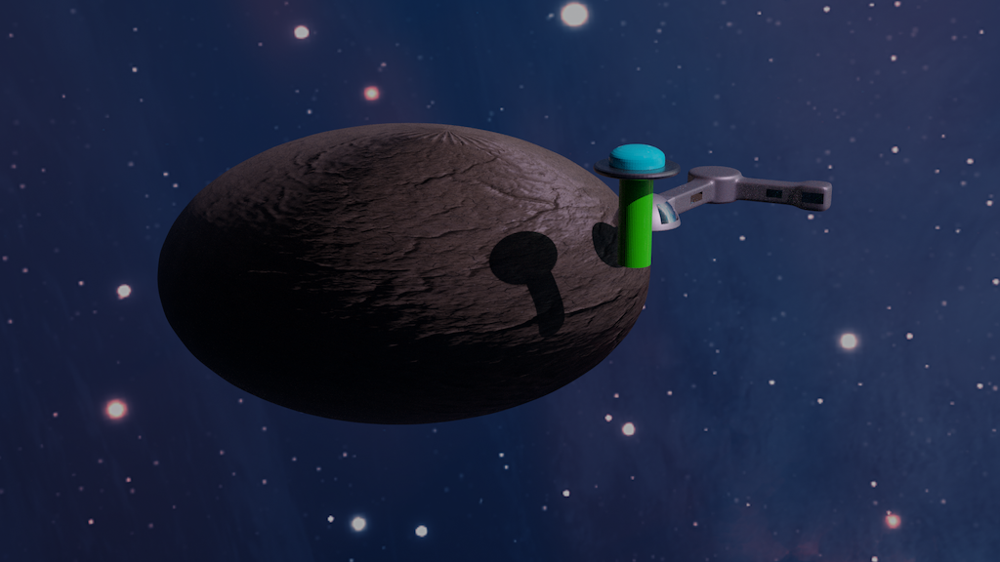

# Blender Jam

October 29, 2019, IIS G. Marconi Civitavecchia.

During the course of 3D Modeling and Blender, we had a short jam session where participants have to work together in groups in order to create a rendering of a scene. The theme was... Space!

At the end of the session, a jury met to evaluate the works.

## Results
We were astonished about the really good work that groups made in the short time of the jam and after only few lessons about Blender. So, congratulations to all, really, we are proud of all you.

We decided to give two prizes and a bunch of special mentions to praize the good work that a team did in a specific field. However, in this page are showcased all the works to show that all the other works were worthy. Let's start!

### Prize: modelling and lighting

We liked the moving semplicity of the spaceship, it seems that it is approaching a new shining solar system. 

### Prize: composition

We liked very much the shooting of this scene.  This rendering gained also the **special mention "Professinal Job"** for the right timing in delivery and the two flavours of the rendering.

### Mention: team work

We noticed the good team work during the jam. Collaboration is of paramount importance in delivery a good product!

### Mention: materials

The only group that used an emitting light material and used it in a very reasonable way.

### Mention: black and white

We liked the choice to make a spot light with a b/w rendering.

## Showcase
All the works were really good, as you can verify in this full showcase!

### AFK

### Foto nave bella (group name?)

### Lauro & Piferi

### Magici 12

### Sistema solare (group name?)

### Space squad

### Space jumper

### Francesco Bevacqua

### The Void

### UFO

